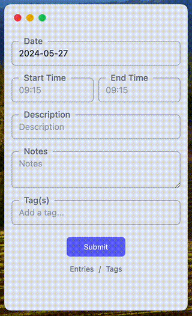
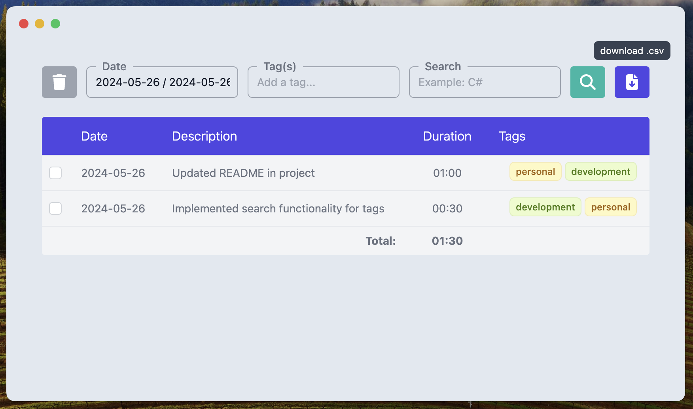
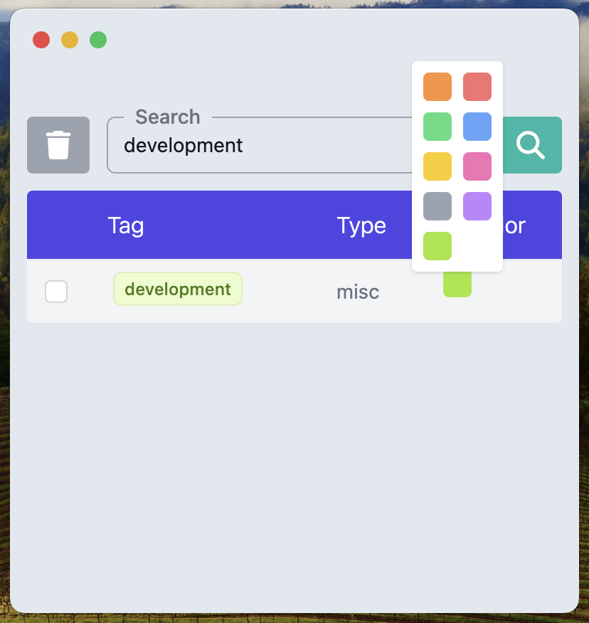

# Hourglass - Private Time Registration


## Description
Hourglass is a minimalist desktop app designed to record time that you input. As a freelancer managing multiple clients, I discovered the need for a straightforward way to manually log hours—without the overhead of complex systems or the requirement for user accounts and the like. That is why I created Hourglass, its local, its private and it does not record anything that is happening on the screen, ensuring you have full control over what gets saved. This makes it ideal for those who need simplicity and privacy. It operates offline and stores all data locally using MongoDB, so there’s no need for accounts or internet connectivity. However, you can always start up an offsite server or container and run the api from there.

Whether you’re a freelancer tracking billable hours or someone who values a direct and private approach to time recordings, Hourglass offers a clean, effective solution to keep your schedule organized and under your control. Try it out; it might just streamline how you track time!

If you like this app, please buy me a coffee :-)

<a href="https://www.buymeacoffee.com/oliverengels" target="_blank">
    
</a>

## Features
- **Easy Time Entry**: Add and edit time entries with just a few clicks.
- **Local Storage**: All data is stored locally in MongoDB to ensure fast access and control over your data.
- **Simplistic UI**: A clean and intuitive interface that makes tracking time hassle-free.
- **Privacy Focused**: No data leaves your machine. Everything is managed locally, unless you want to, its always possible to setup a offsite connection of course.

## Getting started

You can either build the app directly from the source code or download a version from github.

### Build from source

For Building from source code, make sure you have node.js installed ([link](https://nodejs.org/en)) and create a **.env** file in the root of the project with the following information:

```
ELECTRON_PORT = 4251 [or any other port of you choosing]

NEXT_PUBLIC_MONGO_API_PORT = 4250 [or any other port of you choosing]
NEXT_PUBLIC_MONGO_USER = user [user of the datbabase]
NEXT_PUBLIC_MONGO_DB = hourglass [name of the database]
NEXT_PUBLIC_MONGO_PASSWORD = [a password for the database]

NEXT_PUBLIC_ENV = [prod/dev, indicates whether the app should be in production or development mode]
```

1. Open a terminal in the root of the project
2. Install Yarn by typing: ```npm install yarn -g```
3. Install the packages: ```yarn install```
4. Build the app: ```yarn build-electron```

After this there should be a release directory in the root that will have a version of the app in there that you can use or install.

### Building the Database / API

The database will be deployed with Docker, please make sure you have docker installed ([link](https://www.docker.com/get-started/)).

1. Make sure that Docker is running
2. Open a terminal in the root of the project
3. Build the containers by typing: ```docker-compose up -d``` or ```docker-compose up```, the later will show you the logs and will keep the container running as long as the terminal stays open.

If you want to run the container on a different port you can change it in the a **.env** file.

### Updating the app

To maintain the "nothing leaves your computer" aspect of the app, you will not receive notifications for new software releases. Therefore, you'll need to independently check for updates on Git. If you'd like to upgrade, simply pull or download the latest version of the repository and run the following command again: ```yarn build-electron```.

Depending on the changes, you may also need to rebuild the api, simply type: ```docker-compose up -d``` and it should be fine.

## Still Under Construction

This app is still actively being build, I will add a dev channel where the latest version can be downloaded from. However, if you want to be safe use the release channel.

## Handy Things to Know

- **Double Click**: You can *Double Click* the *start* and *end time* input to quickly add the current time to input. Double Clicking the month in the calander will bring you to the current month as well.
- **Tab**: Press tab in the *Tag(s)*, input will auto complete the tag. Of course you still have to press *Enter* to make the selection.
- **Edit**: Clicking an Entry in the Entries screen will open the logger where you can edit the input. Currently I have not yet developed a way to edit Tag text, but that will be added in the future.

<div style="display: flex; justify-content: center; margin: 15px 0px">
    
</div>

- **Export to .csv**: In the entries window there is an export button to excel in the top right, click that to export the current viewed table to an *.csv* file.
- **Tag Colors**: In the Tags window, you can change the color of a tag. Although there are only a few options available, they should suffice for your needs.

<div style="display: flex; justify-content: center; margin: 15px auto">
    
    
</div>

## FAQ

**Q1: Can I not simply use an excel file for this?**
- **A**: Yes, you can. However, Excel requires a paid subscription, and keeping an Excel file open can be quite a hassle as it takes up a lot of screen real estate. Nevertheless, I have an Excel file that performs the same function ([link]()). Feel free to use that instead.

**Q2: I can see that there is a UniqueId registered in the code, I thought this was fully private?**
- **A**: You’re right. I am currently in the process of recording times in the database using a unique ID. However, if you keep MongoDB local, the privacy aspect remains largely unchanged. Nevertheless, I have received requests to make the app register IDs in an offsite database to track times for teams or multiple users. I am working on adding that functionality.
- **Note:** If you feel like this goes against the principles of the app than you can commend out or complete remove line <span style="color:#568914">228</span> to <span style="color:#568914">231</span> in the **index.tsx** file and rebuild the app.

**Q3: I’m having trouble installing the app. Can you help?**
- **A**: Certainly! You can contact me at `contact@oliverengels.com`. If the issue is less urgent, you can also [open an issue]() on the GitHub repository.

**Q4: I noticed the app is not using an HTTPS connection. Why is that?**
- **A**: In most cases, the app is intended to run locally with a local Docker container. If you deploy it on a server, I trust you would be able to configure it to use an HTTPS connection. That said, I am considering adding instructions for enabling HTTPS either in the README or more generally within the app. Stay tuned!